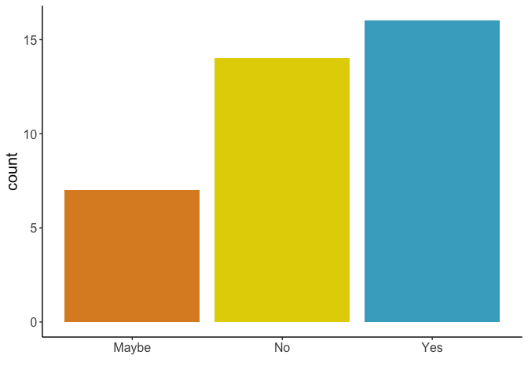
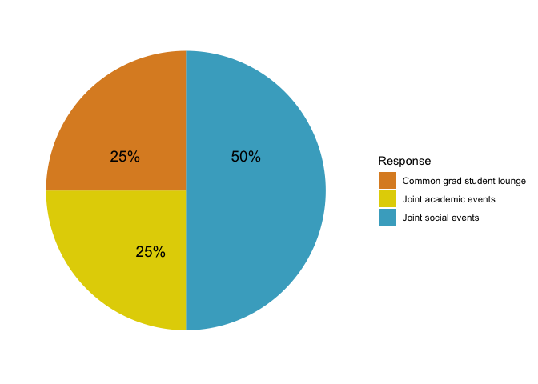
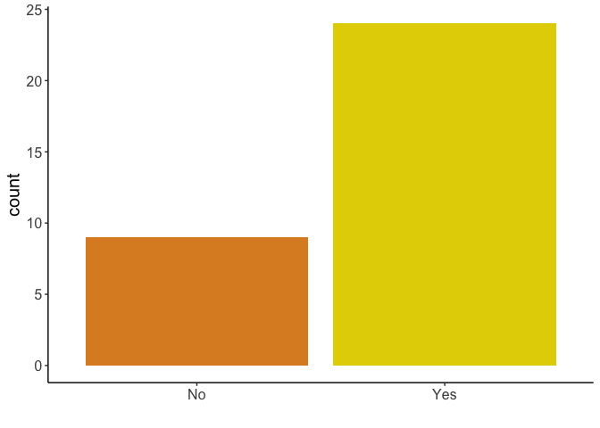
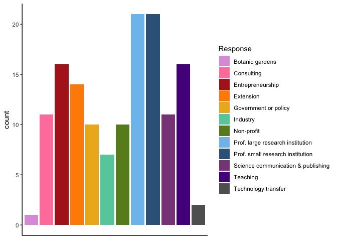
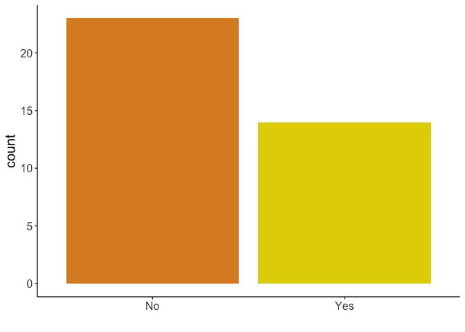

2019 SIPS Grad Student Climate Survey Results
================
Survey authored by Janani Hariharan, results compiled by Ellie Taagen

-----

> In 2019 the School of Integrative Plant Science (SIPS) graduate
> student council developed a survey to assess the SIPS graduate
> students satisfaction and concerns with unification of the five
> sections, career path exploration, mental health resources and
> inclusion initiatives. The survey was distributed via the SIPS
> graduate student listserv (179 students). The 47 participant’s
> responses are summarized
below.

#### 1\) Should there be an introductory curriculum for all incoming SIPS graduate students and if yes, what should the classes be? (37 responses)

<!-- -->

**Suggested topics for core curriculum class:**

  - Exposure to general research in SIPS  
  - Opportunity to meet students from other SIPS sections  
  - Grant writing seminar  
  - Introduction to graduate school (scientific writing, presentation
    skills, teaching pedagogy. RCR, TAing advice, research methods,
    statistics, communication, leadership and mentorship
skills)

-----

#### 2\) How can we increase interactions between graduate students from different sections?

<!-- -->

**Suggested joint social events:**

  - Greenhouse parties  
  - Bowling nights, board game nights  
  - Head to TGIF at the Big Red Barn together  
  - Revive PPPMB’s Cheers with your Peers or make our own SNEEB  
  - “Meals with Strangers” where 4-5 graduate students from different
    sections are matched up and given a dinner allowance

**Suggested joint academic events:**

  - Joint section lightning talks  
  - Grad student
colloquium

-----

#### 3\) Do you have any suggestions for the SIPS building renovations that would be helpful for graduate students?

**Bradfield renovations:** 

  - *“Greater transparency about plans, expected changes and timelines,
    especially with time-sensitive nature of some experiments.”*
  - *“Windows (for Bradfield occupants).”*  
  - *“More power outlets at the ends of the halls in Bradfield.”*
  - *“Gender neutral bathrooms, and more even distribution of M/F
    bathrooms in Bradfield Hall.”*

**Accessible common areas:** 

  - *“Common meeting spaces exclusively for graduate students, with
    comfortable chairs, tables and desks. The goal of such a space is to
    increase grad wellness and socializing.”*  
  - *“Accessibility for non-hearing grad students: open spaces where
    people can see each other and communicate, less noisy ventilation
    and heating systems, high contrast stairs.”*  
  - *“Additional privacy/accessibility: bright lights that don’t cause
    eyestrain, cloth dividers to ensure privacy and mute noise, more
    ergonomic seating.”*

**Anti-common lab spaces:** 

  - *“Communal lab spaces would kill productivity and create resentment
    among lab groups, possibly reducing peer interaction.”*  
  - *“Getting work done for your thesis/dissertation is hard enough
    without also being plopped into an open space with little privacy,
    or worse, having to tiptoe around other people in the same lab. The
    workplace does not need to be the venue for social interaction, or
    even for professional
connection-making.”*

-----

#### 4\) What do you think about the application and review process for the Schmittau-Novak Small Grants Program?

> Respondents had either not heard of / not applied, and hence did not
> know anything about it, or had **positive opinions** about the
> program. They thought it was fair and offered good feedback,
> efficient, promoted collaborations within SIPS, and that it was one of
> the **few funding options open to non US citizens**. One respondent
> mentioned wanting **more reminders** so that they could plan their
> application better, and another mentioned lack of clarity about the
> review
process.

-----

#### 5\) How can SIPS support graduate students in mentoring undergraduates?

  - *“Could mentoring an undergraduate count towards a teaching
    requirement or course credits?”*

  - *“Setting clear expectations on mentoring, aided by mentorship
    training.”*

  - *“Creating a common SIPS webpage where graduate students or PIs
    looking for undergrads would post details of project and pay. This
    could be promoted via undergrad listservs.”*

  - *“Greater connection with undergrads wanting research experience
    through listservs or online forums, connecting with undergraduate
    research organizations.”*

  - *“GSMU-style dinners and mentorship programs.”*

  - *“Provide funding specifically for undergraduate mentoring.”*

  - *“Impostor syndrome is a barrier to mentoring undergrads.”*

  - *“Support from PI with the mentoring process: Flexibility to say no,
    autonomy to pursue independent ideas with undergraduate research
    project.”*

  - *“The Schmittau-Novak program was mentioned as a good way to promote
    undergraduate mentoring.”*

  - Some respondees mentioned having plenty of undergraduate mentees and
    having no questions about the mentoring
process.

-----

#### 6\) Are you interested in extension or international training/jobs and if yes, how should information about jobs/training be made available? (33 responses)

<!-- -->

**Yes, and:**

  - Communicate via a central website that students could also
    contribute to, i.e. Slack  
  - Email listserv (Magdalen’s emails, section chair)  
  - Panel and advice from faculty with similar career backgrounds  
  - Increased opportunities for grad students through established
    programs, i.e.Cornell Cooperative
Extension

-----

#### 7\) What type of careers are you interested in? Pick all that apply.

<!-- -->

-----

#### 8\) How can SIPS support students in learning about and preparing for different careers?

  - *“Utilize the BEST program more.”*

  - *“Make internships or industry experiences more common.”*

  - *“Invite seminar speakers from non-academic backgrounds.”*

  - *“Mentor pairing for different careers with SIPS alumni.”*

  - *“Promote existing resources for professional development like
    career fairs or library workshops. Lunchtime career chats with
    scientists working in non-academic roles.”*

  - *“Encourage students to take 1 class per semester that isn’t
    directly related to their thesis work.”*

  - *“SIPS should require students to do more career exploration. Making
    this mandatory will discourage PIs from interfering with this
    process.”*

-----

#### 9\) How can SIPS support graduate student mental health and wellbeing?

**Training**

  - *“Sensitivity training for advisors.”*

  - *“Improve clarity on graduate student expectations and requirements.
    It is sometimes unclear who is the right person to ask which
    question, or set up a time to meet them.”*

  - *“Official time off policy for graduate students.”*

  - *“Formalize TA and RA expectations.”*

  - *“Follow a do-no-harm policy and allow for flexibility and time to
    let students take care of their own mental health.”*

**Engagement**

  - *“Have advisors check in about work-life balance and mental
    health.”*

  - *“Clear instructions to TAs and professors on how to deal with
    mental health issues.”*

  - *“Regular meetings between DGS and graduate students.”*

  - *“Active discouragement of “70 hour week” culture by faculty and
    staff."*

  - *“Remove mandatory duties or commitments in Ithaca for Geneva-based
    students. It can be hard to be a part of both communities, and some
    people would like to focus on strengthening bonds with the existing
    Geneva community.”*

  - *“Round table, structured group discussion on mental health led by
    students.”*

**Expansion of resources**

  - *“Mental health support at off-campus locations like Cornell
    AgriTech.”*

  - *“Windows in Bradfield Hall.”*

  - *“Hire new faculty with strong mentorship skills or interests.”*

  - *“Focus on chronic stressors instead of acute stressors,
    i.e. long-term issues that could be aided with therapy.”*

  - *“Build a sense of community with other graduate
students.”*

-----

#### 10\) Does SIPS have an efficient process for dealing with bias and/or harassment incidents? If no, what could be improved?

> #  29/30 respondees were not aware of what policies SIPS had in place to combat bias or harassment in the workplace 

**What could be improved:**

  - Publicized protocol on what to do when faced with such an incident  
  - Address concerns about retaliation when filing complaints  
  - Rectify the feeling that people in power will not take the complaint
    seriously
  - Establish protocol on who to talk to if being harassed, i.e. SIPS
    ombudsman  
  - Train staff on confidentiality and conflict
resolution

-----

#### 11\) Have you seen an improvement in SIPS’ commitment to diversity and inclusion over the last 2 years? If not, what more needs to be done?

<!-- -->

**Listed concerns about what more needs to be done:**

  - Lack of sensitivity training for professors and teaching staff  
  - Little follow-through on conversations related to D\&I  
  - Some sections still use the GRE as a requirement for applications  
  - SIPS ABC is very slow to shift the dial  
  - Lack of participation from graduate students in SIPS ABC  
  - Lack of updates from SIPS ABC to the general SIPS audience  
  - Funds for international students to visit Cornell and SIPS  
  - Resistance from faculty towards harassment training creates an
    unwelcome environment for minorities in SIPS  
  - Lack of representation in SIPS faculty
      - Absence of faculty of color was specifically noted  
      - This leads to lack of appropriate mentorship and lack of
        belonging
